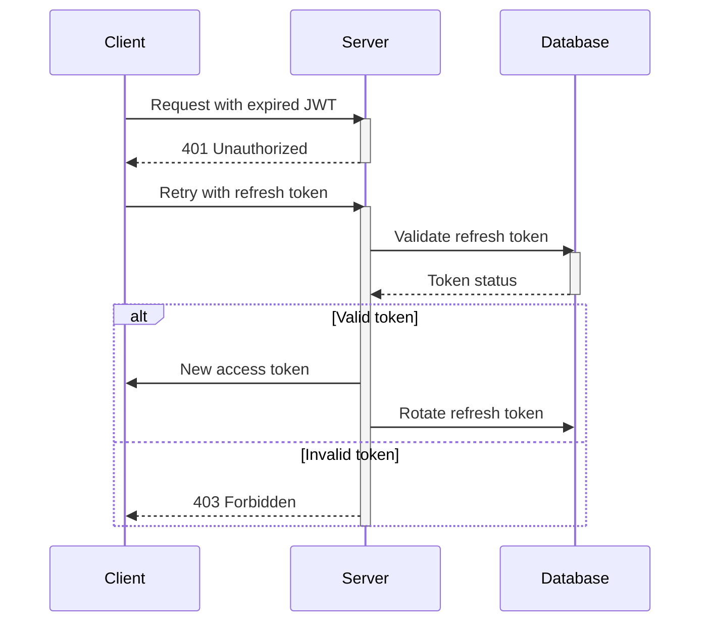

<p align="center">
  <a href="http://nestjs.com/" target="blank"></a>
</p>

[circleci-image]: https://img.shields.io/circleci/build/github/nestjs/nest/master?token=abc123def456
[circleci-url]: https://circleci.com/gh/nestjs/nest

  <p align="center">A progressive <a href="http://nodejs.org" target="_blank">Node.js</a> framework for building efficient and scalable server-side applications.</p>
    <p align="center">
<a href="https://www.npmjs.com/~nestjscore" target="_blank"></a>
<a href="https://www.npmjs.com/~nestjscore" target="_blank"></a>
<a href="https://www.npmjs.com/~nestjscore" target="_blank"></a>
<a href="https://circleci.com/gh/nestjs/nest" target="_blank"></a>
<a href="https://coveralls.io/github/nestjs/nest?branch=master" target="_blank"></a>
<a href="https://discord.gg/G7Qnnhy" target="_blank"></a>
<a href="https://opencollective.com/nest#backer" target="_blank"></a>
<a href="https://opencollective.com/nest#sponsor" target="_blank"></a>
  <a href="https://paypal.me/kamilmysliwiec" target="_blank"></a>
    <a href="https://opencollective.com/nest#sponsor"  target="_blank"></a>
  <a href="https://twitter.com/nestframework" target="_blank"></a>
</p>
  <!--[](https://opencollective.com/nest#backer)
  [](https://opencollective.com/nest#sponsor)-->

## Description

[Nest](https://github.com/nestjs/nest) framework TypeScript starter repository.

## Installation

```bash
$ pnpm install
```

## Running the app

```bash
# development
$ pnpm run start

# watch mode
$ pnpm run start:dev

# production mode
$ pnpm run start:prod
```

## Test

```bash
# unit tests
$ pnpm run test

# e2e tests
$ pnpm run test:e2e

# test coverage
$ pnpm run test:cov
```


## Automatic Token Renewal via JWT Strategy and Passport Guard

This project implements automatic access token renewal using **Passport.js** and **JWT strategy**. It validates the refresh token when the access token expires and issues a new token automatically, without needing a dedicated `/refresh` endpoint.

### Key Features:
- **Passport Guard**: Uses a guard to validate the refresh token and automatically renew the access token.
- **No /refresh Endpoint**: Eliminates the need for a separate refresh endpoint.
- **Secure Token Rotation**: Refresh tokens are securely rotated after each use to prevent misuse.

### Authentication Flow:



### How It Works:
- When the access token expires, the system checks the refresh token.
- If valid, a new access token is issued, and the refresh token is rotated.
- This process ensures security while providing a seamless experience for the user.

### Benefits:
- **Streamlined Authentication**: No manual token refresh request is needed.
- **Enhanced Security**: Proper token rotation prevents misuse.
- **Seamless User Experience**: Transparent token renewal without additional API calls.


## 🔐 Authorization Module (Role & Permission System)

This module implements a robust role-based access control (RBAC) system using custom decorators and guards in NestJS. It enables fine-grained access control for users based on their assigned roles and permissions.

### ✨ Features

- Role-based permission management
- Custom `@Permission()` decorator
- Global `PermissionGuard` to restrict access to routes
- Integration with JWT authentication
- CRUD endpoints for permissions

---

### 📁 Controller Endpoints

| Method | Route                        | Description                    | Required Permission         |
|--------|------------------------------|--------------------------------|---------------------------- |
| POST   | /auth/permission/create      | Create a new permission        | `permission.add`            |
| GET    | /auth/permission/get         | Get all permissions            | `permission.view-all`       |
| GET    | /auth/permission/get/:id     | Get permission by user ID      | `permission.view`           |
| PATCH  | /auth/permission/update/:id  | Update a permission            | `permission.update`         |
| DELETE | /auth/permission/delete/:id  | Delete a permission            | `permission.delete`         |

---

### 🛡️ How Authorization Works

1. **JwtWithRefreshAuthGuard** authenticates the user using access or refresh token.
2. **PermissionGuard** checks if the user has the required permission.
3. **@Permission('your.permission.code')** decorator is used to mark which permission is needed for a specific route.

---

## 🔐 Role-Based Authorization (PermissionGuard + @Permission)

This module enables fine-grained access control in your NestJS API using a custom `@Permission` decorator and `PermissionGuard`. It follows a Role-Based Access Control (RBAC) pattern where each role is associated with a list of permission keys.

---

### ⚙️ How It Works

1. You decorate protected endpoints using `@Permission('permission.key')`.
2. The `PermissionGuard`:
   - Reads the permission key from the decorator.
   - Extracts the user ID from the JWT payload.
   - Fetches the user's permissions (through their role) from the database.
   - Compares the required key with the user's assigned permissions.
3. If the permission matches, access is granted. Otherwise, a `403 Forbidden` response is returned.

---

### 📊 Authorization Flow

```text
┌────────────┐
│  API Call  │
└────┬───────┘
     │
     ▼
┌───────────────┐
│ @Permission() │ ◄──── Defines required permission
└────┬──────────┘
     │
     ▼
┌────────────────────┐
│  PermissionGuard   │
└────┬────────┬──────┘
     │        ▼
     │   Required Permission
     ▼
User ID (from JWT)
     │
     ▼
┌─────────────────────────────┐
│ Fetch role-permission keys  │
└─────────────────────────────┘
     │
     ▼
┌────────────────────────┐
│ Compare permissions     │
└─────────┬──────────────┘
          │ Match?
     ┌────▼────┐      ┌─────────────┐
     │  Yes    │      │     No      │
     │ Access  │      │  Forbidden  │
     └─────────┘      └─────────────┘


```

### 🧱 Usage

To secure a route, apply the following decorators:


```ts
@UseGuards(JwtWithRefreshAuthGuard, PermissionGuard)
@Permission('permission.view')
@Get('your-route')
async yourHandler() {
  // Your logic
}
```

## ⚙️  API Rate Limiting Guards

This module provides two NestJS guards to enforce request rate limits:

* **RateLimitGuard**: Apply per-route rate limiting for both public (unauthenticated) and protected (authenticated) APIs, supporting multiple time windows.
* **LoginAttemptGuard**: Specifically throttle login attempts to prevent brute-force attacks.


###  Rate Limiting Architecture
```text
Client Request
    │
    ▼
RateLimitGuard
    │
    ├─▶ Protected (Authenticated) ? ──▶ Check user-based limits
    │                                           │
    └─▶ Public (Unauthenticated)    ──▶ Check IP-based limits
                                                │
                                                ▼
                                      Update rate limit store

```
###  Features
* **Per-route configuration**: Customize limits at controller or method level
* **Multiple slots**: Enforce several windows (e.g. short, medium, long term) simultaneously
* **Separate keys**: Track limits by user ID or IP + route + window
* **Blocked state**: Set `blockedUntil` to prevent further requests until window expires
* **IP normalization**: Handle IPv4-mapped IPv6 addresses (`::ffff:…`)


### Rate Limit Store
A simple in-memory store at `src/common/rate-limit/rate-limit.store.ts`:

```ts
export const rateLimitStore = {
  authenticated: new Map<string, number[]>(),
  unauthenticated: new Map<string, { timestamps: number[], blockedUntil: number }>(),
};
```


###  Decorator: `@RateLimit()`

Define limits by passing either a single `RateLimitOptions` object or an array for multiple windows.

```ts
import { SetMetadata } from '@nestjs/common';
export interface RateLimitOptions {
    windowMs?: number;
    userLimit?: number;
    deviceLimit?: number;
  }
  export const RATE_LIMIT_KEY = 'rate_limit_options';
  export const RateLimit = (opts: RateLimitOptions) =>
    SetMetadata(RATE_LIMIT_KEY, opts);

```

### Use Decorate: 
```ts
import { RateLimit } from 'src/common/decorators/rate-limit.decorator';

// Single slot
@RateLimit({ windowMs: 60_000, userLimit: 5, deviceLimit: 10 })

// Multiple slots
@RateLimit([
  { windowMs:   60_000, userLimit:  2, deviceLimit:  5 },  // short term
  { windowMs:3_600_000, userLimit: 10, deviceLimit: 20 },  // hourly
  { windowMs:86_400_000,userLimit:100,deviceLimit:200 },  // daily
])
```


### 2. Apply `RateLimitGuard`

```ts
A simple in-memory store at `src/common/guards/rate-limit.guard.ts`:
@Get('me')
  @UseGuards(JwtWithRefreshAuthGuard, RateLimitGuard)
  @RateLimit({ windowMs: 30_000, userLimit: 5, deviceLimit: 10 })
  async getMe(@CurrentUser() user: User) {
    return this.usersService.getUser({ _id: user._id });
  }

```

### Support

Nest is an MIT-licensed open source project. It can grow thanks to the sponsors and support by the amazing backers. If you'd like to join them, please [read more here](https://docs.nestjs.com/support).

## Stay in touch

- Author - [Chanu Abdullah]

## License

