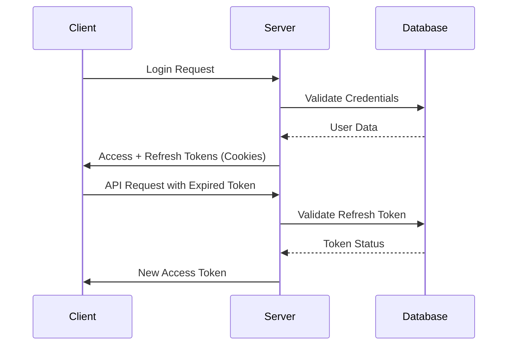

<p align="center">
  <a href="http://nestjs.com/" target="blank"></a>
</p>

[circleci-image]: https://img.shields.io/circleci/build/github/nestjs/nest/master?token=abc123def456
[circleci-url]: https://circleci.com/gh/nestjs/nest

  <p align="center">A progressive <a href="http://nodejs.org" target="_blank">Node.js</a> framework for building efficient and scalable server-side applications.</p>
    <p align="center">
<a href="https://www.npmjs.com/~nestjscore" target="_blank"></a>
<a href="https://www.npmjs.com/~nestjscore" target="_blank"></a>
<a href="https://www.npmjs.com/~nestjscore" target="_blank"></a>
<a href="https://circleci.com/gh/nestjs/nest" target="_blank"></a>
<a href="https://coveralls.io/github/nestjs/nest?branch=master" target="_blank"></a>
<a href="https://discord.gg/G7Qnnhy" target="_blank"></a>
<a href="https://opencollective.com/nest#backer" target="_blank"></a>
<a href="https://opencollective.com/nest#sponsor" target="_blank"></a>
  <a href="https://paypal.me/kamilmysliwiec" target="_blank"></a>
    <a href="https://opencollective.com/nest#sponsor"  target="_blank"></a>
  <a href="https://twitter.com/nestframework" target="_blank"></a>
</p>
  <!--[](https://opencollective.com/nest#backer)
  [](https://opencollective.com/nest#sponsor)-->

## Description

[Nest](https://github.com/nestjs/nest) framework TypeScript starter repository.

## Installation

```bash
$ pnpm install
```

## Running the app

```bash
# development
$ pnpm run start

# watch mode
$ pnpm run start:dev

# production mode
$ pnpm run start:prod
```

## Test

```bash
# unit tests
$ pnpm run test

# e2e tests
$ pnpm run test:e2e

# test coverage
$ pnpm run test:cov
```

# 🚀 NestJS API Template

A comprehensive NestJS API template with authentication, authorization, rate limiting, and modern development practices.

## ✨ Features

- 🔐 **JWT Authentication** with automatic token renewal
- 🛡️ **Role-Based Authorization** with permission system
- ⚡ **Rate Limiting** with multiple time windows
- 🏥 **Health Checks** for monitoring
- 📊 **Request Logging** and error tracking
- 🔒 **Security Headers** and CORS protection
- 🐳 **Docker Support** with MongoDB
- 📚 **Swagger Documentation**
- ✅ **Environment Validation**
- 🧪 **Testing Setup**

## 🚀 Quick Start

### Prerequisites

- Node.js (v18+)
- Docker & Docker Compose
- pnpm (recommended) or npm

### Installation

1. **Clone and install dependencies**
```bash
git clone <repository-url>
cd nest-api-template
pnpm install
```

2. **Setup environment**
```bash
cp example.env .env
# Edit .env with your configuration
```

3. **Start database**
```bash
pnpm run db:up
```

4. **Run the application**
```bash
# Development
pnpm run start:dev

# Production
pnpm run build
pnpm run start:prod
```

## 📋 Available Scripts

| Script | Description |
|--------|-------------|
| `pnpm run start:dev` | Start in development mode with hot reload |
| `pnpm run build` | Build the application |
| `pnpm run start:prod` | Start in production mode |
| `pnpm run test` | Run unit tests |
| `pnpm run test:e2e` | Run end-to-end tests |
| `pnpm run lint` | Lint and fix code |
| `pnpm run format` | Format code with Prettier |
| `pnpm run db:up` | Start MongoDB with Docker |
| `pnpm run db:down` | Stop MongoDB |
| `pnpm run db:reset` | Reset database (removes all data) |

## 🔐 Authentication System

### Features
- **JWT Access & Refresh Tokens**
- **Automatic Token Renewal**
- **Secure Cookie Storage**
- **Password Hashing with bcrypt**
- **Multiple Login Methods** (Email/Phone)

### Authentication Flow



## 🛡️ Authorization System

### Permission-Based Access Control

Use the `@Permission()` decorator to protect routes:

```typescript
@UseGuards(JwtWithRefreshAuthGuard, PermissionGuard)
@Permission('user.read')
@Get('profile')
async getProfile(@CurrentUser() user: User) {
  return this.userService.getProfile(user.id);
}
```

### Permission Keys Structure
- `user.read` - Read user data
- `user.write` - Create/update users
- `user.delete` - Delete users
- `admin.*` - All admin operations

## ⚡ Rate Limiting

### Configuration

```typescript
@RateLimit([
  { windowMs: 60_000, userLimit: 5, deviceLimit: 10 },   // 1 minute
  { windowMs: 3_600_000, userLimit: 100, deviceLimit: 200 }, // 1 hour
])
@Get('api/endpoint')
async endpoint() {
  // Your logic
}
```

## 🏥 Health Monitoring

### Endpoints
- `GET /health` - Basic health check
- `GET /health/ready` - Readiness check (includes DB)

### Response Example
```json
{
  "status": "ok",
  "timestamp": "2024-01-01T00:00:00.000Z",
  "uptime": 3600,
  "environment": "development",
  "database": {
    "status": "connected",
    "readyState": 1
  },
  "memory": {
    "used": 45,
    "total": 128
  }
}
```

## 🔧 Configuration

### Environment Variables

| Variable | Description | Default |
|----------|-------------|---------|
| `PORT` | Server port | `5000` |
| `NODE_ENV` | Environment | `development` |
| `MONGODB_URL` | Database connection | Required |
| `JWT_ACCESS_TOKEN_SECRET` | JWT secret | Required |
| `JWT_ACCESS_TOKEN_EXPIRATION_MS` | Token expiry | `900000` (15min) |
| `JWT_REFRESH_TOKEN_SECRET` | Refresh secret | Required |
| `JWT_REFRESH_TOKEN_EXPIRATION_MS` | Refresh expiry | `604800000` (7days) |
| `APP_CORS_ORIGIN` | CORS origins | `http://localhost:3000` |

## 🐳 Docker Support

### Start Services
```bash
docker-compose up -d
```

### Services
- **MongoDB**: `localhost:27017`
- **API**: `localhost:5000`

## 📚 API Documentation

When running in development mode, visit:
- **Swagger UI**: `http://localhost:5000/api`
- **Health Check**: `http://localhost:5000/health`

## 🧪 Testing

```bash
# Unit tests
pnpm run test

# E2E tests
pnpm run test:e2e

# Coverage
pnpm run test:cov
```

## 🔒 Security Features

- ✅ Helmet security headers
- ✅ CORS protection
- ✅ Rate limiting
- ✅ JWT token rotation
- ✅ Password hashing
- ✅ Input validation
- ✅ SQL injection protection (MongoDB)
- ✅ XSS protection

## 📁 Project Structure

```
src/
├── api/                    # API modules
│   ├── auth/              # Authentication
│   ├── users/             # User management
│   └── permission/        # Authorization
├── common/                # Shared utilities
│   ├── decorators/        # Custom decorators
│   ├── guards/            # Guards
│   ├── filters/           # Exception filters
│   └── interceptors/      # Request/response interceptors
├── config/                # Configuration
├── health/                # Health checks
└── utils/                 # Utility functions
```

## 🤝 Contributing

1. Fork the repository
2. Create a feature branch
3. Make your changes
4. Add tests
5. Submit a pull request

## 📄 License

This project is licensed under the MIT License.

---

**Built with ❤️ using NestJS**

